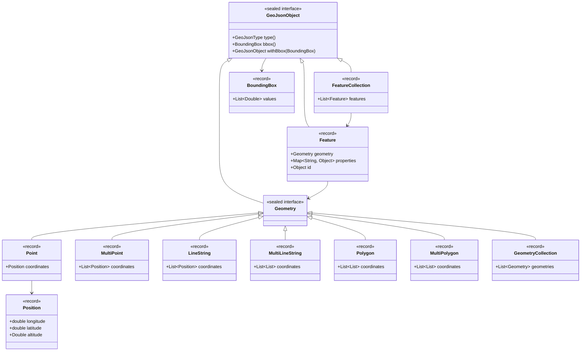

# GeoJSON Object Model for Java

[](https://github.com/luktomaszewski/geojson-model-java/actions/workflows/build.yml)

An immutable Java object model for [RFC 7946](https://tools.ietf.org/html/rfc7946), the GeoJSON
Format Specification. It reads and writes GeoJSON through Jackson with no configuration, no custom
module and no serializer to register.

Requires Java 21 or later.

## Data model

Every type in the model is a `GeoJsonObject`. `GeoJsonObject` and `Geometry` are sealed interfaces,
so the compiler knows the full set of possibilities; every implementation is an immutable record.



## Usage

### Writing

```java
FeatureCollection collection = FeatureCollection.of(
        Feature.of(
                LineString.of(
                        new Position(18.63, 54.37),
                        new Position(21.01, 52.23),
                        new Position(19.94, 50.04),
                        new Position(16.92, 52.40))));

String json = new ObjectMapper().writeValueAsString(collection);
```

```json
{
  "type": "FeatureCollection",
  "features": [
    {
      "type": "Feature",
      "geometry": {
        "type": "LineString",
        "coordinates": [
          [18.63, 54.37],
          [21.01, 52.23],
          [19.94, 50.04],
          [16.92, 52.40]
        ]
      },
      "properties": null
    }
  ]
}
```

### Reading

The concrete type does not have to be known up front — the "type" member drives deserialization:

```java
ObjectMapper mapper = new ObjectMapper();

FeatureCollection collection = mapper.readValue(json, FeatureCollection.class);
Geometry geometry = mapper.readValue(json, Geometry.class);
GeoJsonObject anything = mapper.readValue(json, GeoJsonObject.class);
```

Because `Geometry` is sealed, dispatching on it is exhaustive — no `default` branch, and adding a
geometry type would be a compile error rather than a silent fall-through:

```java
String description = switch (geometry) {
    case Point p -> "a point at " + p.coordinates();
    case LineString l -> "a line of " + l.coordinates().size() + " positions";
    case Polygon p -> "a surface with " + p.holes().size() + " holes";
    case MultiPoint p -> "...";
    case MultiLineString l -> "...";
    case MultiPolygon p -> "...";
    case GeometryCollection c -> "...";
};
```

### Modifying

The model is immutable; the `with…` methods return a copy:

```java
Feature feature = Feature.of(Point.of(18.63, 54.37))
        .withId("gdansk")
        .withProperties(Map.of("name", "Gdańsk"))
        .withBbox(BoundingBox.of(18.63, 54.37, 18.63, 54.37));
```

## What the model enforces

Invalid geometries are rejected at construction time, whether you build them by hand or read them
from JSON:

| Rule | Source |
| --- | --- |
| A position has 2 or 3 finite coordinates | [§3.1.1](https://tools.ietf.org/html/rfc7946#section-3.1.1) |
| A LineString has at least 2 positions | [§3.1.4](https://tools.ietf.org/html/rfc7946#section-3.1.4) |
| A linear ring has at least 4 positions and is closed | [§3.1.6](https://tools.ietf.org/html/rfc7946#section-3.1.6) |
| A bounding box has 4 values (2D) or 6 (3D) | [§5](https://tools.ietf.org/html/rfc7946#section-5) |
| A Feature id is a string or a number | [§3.2](https://tools.ietf.org/html/rfc7946#section-3.2) |

Ring winding order is **not** enforced: §3.1.6 asks parsers not to reject polygons that fail to
follow the right-hand rule.

Unknown ("foreign") members are ignored when reading rather than rejected. `geometry` and
`properties` are always written on a Feature, as `null` when absent, because RFC 7946 requires both
members to be present.

## Building

```
./gradlew build
```

## Reporting bugs & improvements

If you find any bug or improvement, please report it in the `Issues` section.

## Useful links

* [The GeoJSON Format Specification](https://tools.ietf.org/html/rfc7946)
* [GeoJSON Web Viewer](http://geojson.io/)
